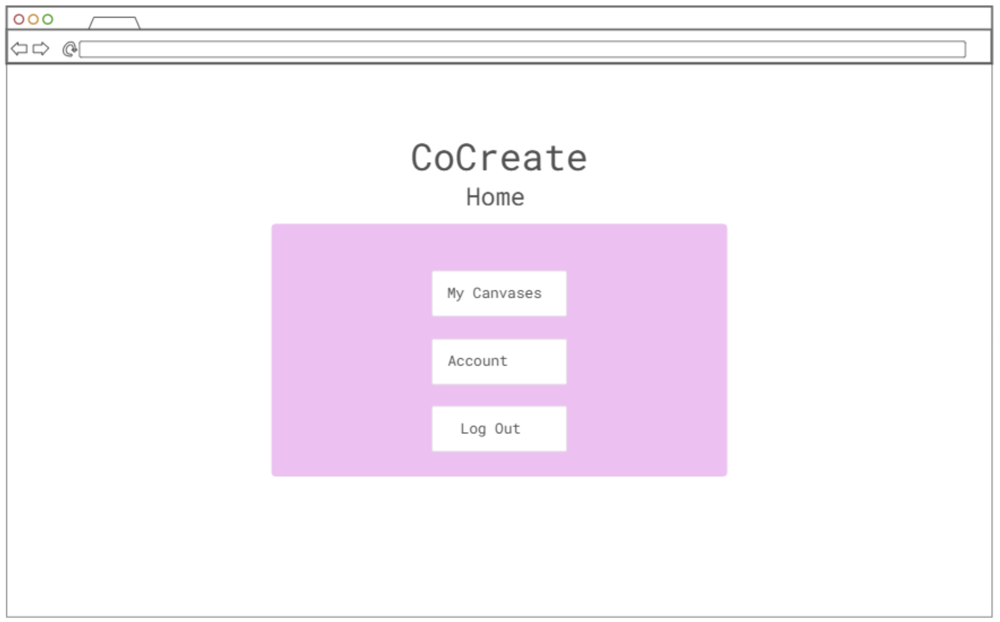
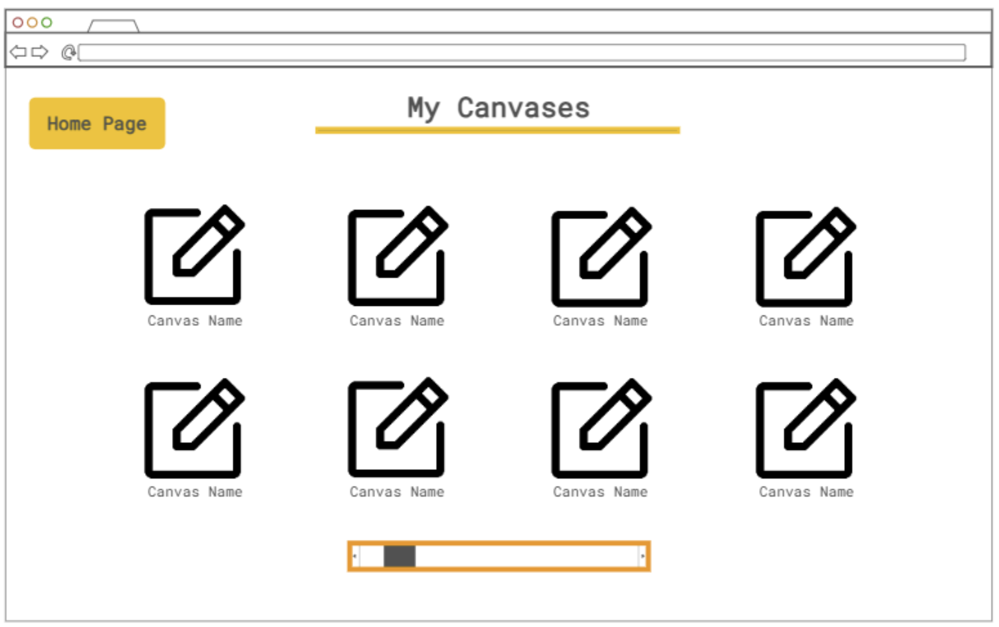
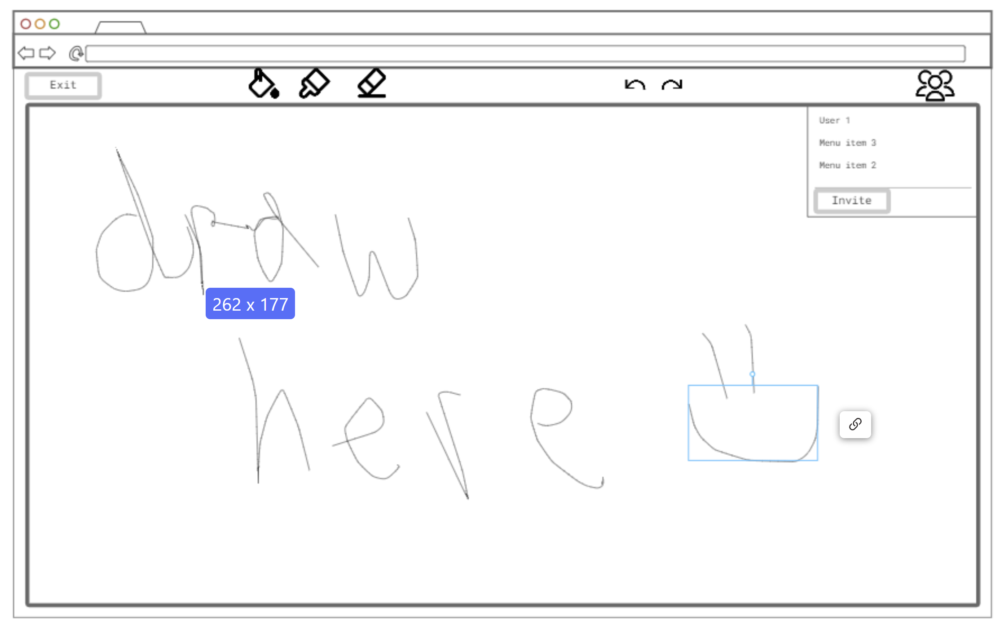

# CoCreate

[My Notes](notes.md)

CoCreate is a collaborative drawing application, that allows multiple users to create and interact on a shared digital canvas at the same time. Updates to the canvas are shown in real-time using WebSockets to broadcast user's edits to each other. 

> [!NOTE]
>  This is a template for your startup application. You must modify this `README.md` file for each phase of your development. You only need to fill in the section for each deliverable when that deliverable is submitted in Canvas. Without completing the section for a deliverable, the TA will not know what to look for when grading your submission. Feel free to add additional information to each deliverable description, but make sure you at least have the list of rubric items and a description of what you did for each item.

**Heading 2**

> [!NOTE]
>  If you are not familiar with Markdown then you should review the [documentation](https://docs.github.com/en/get-started/writing-on-github/getting-started-with-writing-and-formatting-on-github/basic-writing-and-formatting-syntax) before continuing.

## 🚀 Specification Deliverable

> [!NOTE]
>  Fill in this sections as the submission artifact for this deliverable. You can refer to this [example](https://github.com/webprogramming260/startup-example/blob/main/README.md) for inspiration.

For this deliverable I did the following. I checked the box `[x]` and added a description for things I completed.

- [x] Proper use of Markdown
- [x] A concise and compelling elevator pitch
- [x] Description of key features
- [x] Description of how you will use each technology
- [x] One or more rough sketches of your application. Images must be embedded in this file using Markdown image references.

### Elevator pitch

Ever wish you could sketch out ideas with a friend as if you were sitting right next to them, even though you are on the other side of the world? CoCreate is the answer! It's a real-time, collaborative digital canvas that allows you to create, brainstorm, draw, and share ideas instantly. Whether for professional or casual use, the platform provides a dynamic space for presenting your creativity to others. 

### Design

### Key features

- Logging into account
- Real time synchronization across shared canvases
- Displaying list of users in the current session
- Undoing or reverting changes
- Ablility for canvas creater to share a link with other to access
- Guest access?
- Ability to create, save, name, and delete canvases
- Ability to choose drawing options such as color, stroke size, opacity etc...
- Ability to upload images to the canvas

### Technologies

I am going to use the required technologies in the following ways.

- **HTML** - Single page layout that serves as a foundation for the entire application. It will include the main canvas and the user interface elements for drawing tools and session management. Planning on using one main container of HTML 1- home page 2- login page 3- dashboard/ my canvases page 4- canvas drawing page

- **CSS** - Styling of the main layout, the drawing canvas, and all the interactive tools. Dedicated CSS file for each component to present each page in a user-friendly, clean way. 

- **React** - React Router library will handle the routing for navigation between pages. Using components to represent different parts of the user interface and routing to navigate between them. A component for each part of the application will be created (main app router, home page, login page, drawing board, tools, users in session)

- **Service** - Backend server for:
    - User login/registration/authentication 
    - Retreiving drawing sessions user has access to
    - Creating/managing drawing sessions
    - API to retreive a color palette
    - image search API for importing images to canvas
    - font selsection API

- **Database/Login** - SQL database for storing user authentication details/credentials, managing drawing board sessions, storing the drawing history of sessions

- **WebSocket** - Handling of client connections between the server and other clients with a constand open connection. Makes it so any edits a user makes to the session will be shown on the page on other users interface. 

## 🚀 AWS deliverable

For this deliverable I did the following. I checked the box `[x]` and added a description for things I completed.

- [x] **Server deployed and accessible with custom domain name** - [My server link](https://startup.emmastartup.com).
- [x] Set up my AWS account
- [x] Created a new EC2 instance, and could access the server using http://100.28.64.219
- [x] Leased a domain in Route53
    - My domain name I created is emmastartup.com
- [x] Edited my Caddyfile so that I could access my server through HTTPS.
    - At this point, I was able to securely establish a connection with my domain that I leased since I had secured the connection. 

Issues I ran into:

I could not access my server using http://startup.emmastartup.com due to my computer browser firewalls not letting me establish a connection because the server hadn't been secured yet. However that was quickly resolved once I updated the Caddyfile and established the HTTPS connection.

## 🚀 HTML deliverable

For this deliverable I did the following. I checked the box `[x]` and added a description for things I completed.

- [x] **HTML pages** - Used the Go Live feature on VS code to render the HTML I wrote for each page. First I worked on the "Home" page that is presented to logged in users. Next I created the HTML for the "login" page that lets existing users log into their accoutn and new users to create an accoutn. Both of the log in buttons successfully link to the index html page. 

- [x] **Proper HTML element usage** - Created a footer that contains my name and link to my GitHub that will be on all pages. I used input elements to create username and password input sections. Used "required" attribute on both the username and password. 

- [x] **Links** - the "Log In" and "Create Accout" buttons both link to the home page (index.html), all the links work for surfing between pages. 

Linked the canvases on the dashboard to the canvas.html file. Also included a "delete" button element for each canvas but planning on making it into an x button with CSS and JS for the functionality 

Home Page button links to index.html

- [x] **Text** - Included text descriptions of the buttons and image on my html. The layout is not what I want it to be but hopefully I will fix it with CSS.

- [x] **3rd party API placeholder** - I just used a simple canvas elemetn in HTML to represent what I will be able to import an API for in order to implement the actual functionality of the drawing board

- [x] **Images** - I used some plceholder images for the icons of the canavases but will be replaced with the users actual drawing boards. 

- [x] **Login placeholder** - Created a "welcome user" on the home page of the screen. I made some login input elements but they have no functionality yet

- [x] **DB data placeholder** - User information, as well as the saved canvas boards will eb stored in my database but for now are just represented by images and text. 

- [x] **WebSocket placeholder** - The plan is to have updates of active users and edits in real time with the web socket implementation but for now is represented by a canvas element and a div elemetn containing text

## 🚀 CSS deliverable

For this deliverable I did the following. I checked the box `[x]` and added a description for things I completed.

- [x] **Header, footer, and main content body** - Designed using Bootstrap. Completed on home page, dashboard page, canvas page, login page
- [x] **Navigation elements** - Home page buttons navigate to the dashboard or the login page. Dashboard page buttons and project icons navigate to the home page and canvas page. Login page routes to the home page. All navigation elements work
- [x] **Responsive to window resizing** - Completed on home page, dashboard page, canvas page, login page. Used flex box to help with this
- [x] **Application elements** - I used very minor amoutns of JS to show some of the interactivity of elements on the canvas page. Styled buttons and forms to how I wanted them to look. I made a side bar on the canvas page that pops up from the side of the screen when the icon at the top of the page is clicked and will go away once the icon is clicked again. I also restyled the default appearance of some of the elements like the color selector and the size adjustor bar. 
- [x] **Application text content** - set a standard font for the whole application, correctly aligned and centered text where I wanted them to be placed
- [x] **Application images** - Used Bootstrap's icon library to make some of the selections into symbols rather than just a button

## 🚀 React part 1: Routing deliverable

For this deliverable I did the following. I checked the box `[x]` and added a description for things I completed.

- [x] **Bundled using Vite** - Installed Vite to be the development server and build tool, I used `npm run dev` to run my project
- [x] **Components** - I converted all my static HTML files (login.html, home.html, dashboard.html, canvas.html) into React components. I had to refactor some of my Javascript in the canvas.html file to be compatible with React. The `useState` hooks were to manage things like which tool was selected
- [x] **Router** - I implemented this with the `react-router-dom` provided in the instruction. I used a `<BrowserRouter>` in the app.jsx file that defines all the routes for my application like /, /home etc. I also changed the navigation elements to NavLink components.

## 🚀 React part 2: Reactivity deliverable

For this deliverable I did the following. I checked the box `[x]` and added a description for things I completed.

- [x] **All functionality implemented or mocked out** - Implemented all core app functionality
    - Login functions that are passed to other pages
    - `dashboard.jsx` component uses a `useEffect` to serve as a placeholder for canvases stored in a database specific to each user. 
    - Interactive canvas: The canvas component is a fully functional drawing component. I used React's built in `onMouseDown`, `onMouseMove`, and `onMouseUp` events to create the functionality. 
    - Websocket placeholder: I used a `setInterval` within a hook to simulate how the users in session list will update as users leave and join. 
- [x] **Hooks** - I used Reach hooks to manage the states and handle side effects
    - `useState` is present in all components to manage local states
    - `useEffect` for various events such as checking local storage, fetching the placeholder lists, getting the canvas 2D, and setting up the timer for the WebSocket placeholder. 
    - `useRef`: I used this in the canvas component to refer to the `<canvas>` html element which made it easier to access for the drawing functions. 
    - `useNavigate`: handles the switching of pages when a user logs in or out

## 🚀 Service deliverable

For this deliverable I did the following. I checked the box `[x]` and added a description for things I completed.

- [ ] **Node.js/Express HTTP service** - I did not complete this part of the deliverable.
- [ ] **Static middleware for frontend** - I did not complete this part of the deliverable.
- [ ] **Calls to third party endpoints** - I did not complete this part of the deliverable.
- [ ] **Backend service endpoints** - I did not complete this part of the deliverable.
- [ ] **Frontend calls service endpoints** - I did not complete this part of the deliverable.
- [ ] **Supports registration, login, logout, and restricted endpoint** - I did not complete this part of the deliverable.

## 🚀 DB deliverable

For this deliverable I did the following. I checked the box `[x]` and added a description for things I completed.

- [ ] **Stores data in MongoDB** - I did not complete this part of the deliverable.
- [ ] **Stores credentials in MongoDB** - I did not complete this part of the deliverable.

## 🚀 WebSocket deliverable

For this deliverable I did the following. I checked the box `[x]` and added a description for things I completed.

- [ ] **Backend listens for WebSocket connection** - I did not complete this part of the deliverable.
- [ ] **Frontend makes WebSocket connection** - I did not complete this part of the deliverable.
- [ ] **Data sent over WebSocket connection** - I did not complete this part of the deliverable.
- [ ] **WebSocket data displayed** - I did not complete this part of the deliverable.
- [ ] **Application is fully functional** - I did not complete this part of the deliverable.

[def]: CanvasPage.png